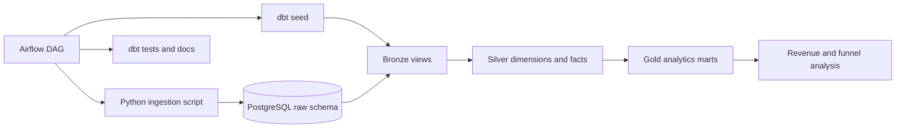
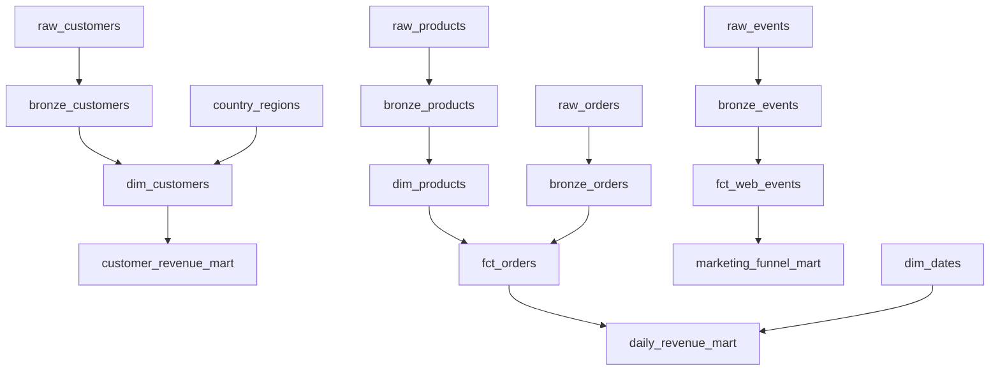

# airflow-dbt-warehouse

A production-style local analytics warehouse built with Airflow, dbt, PostgreSQL, Docker Compose, SQL, pytest, pre-commit, and GitHub Actions.

The project models a realistic ecommerce ELT workflow: deterministic source data is ingested into raw PostgreSQL tables, dbt transforms it through bronze, silver, and gold layers, tests validate the data contract, and Airflow orchestrates the full run with retries, logs, and a pipeline summary.

## Architecture



## Stack

- **Python 3.12** for ingestion utilities, tests, and operational scripts.
- **PostgreSQL 16** as the local warehouse.
- **Apache Airflow** for orchestration, retries, scheduling, and task-level observability.
- **dbt Postgres** for warehouse modeling, lineage, tests, documentation, and exposures.
- **Docker Compose** for repeatable local services.
- **pytest, Ruff, pre-commit, GitHub Actions** for quality gates.

## Warehouse Layers

- **Raw**: source-shaped tables loaded by `scripts/ingest_raw_data.py`.
- **Bronze**: normalized and deduplicated source views such as `bronze_orders`.
- **Silver**: business-ready dimensions and facts such as `dim_customers`, `dim_products`, `dim_dates`, `fct_orders`, and `fct_web_events`.
- **Gold**: stakeholder marts for revenue, customer segmentation, and marketing funnel analysis.

Key SQL patterns include CTEs, window functions, deduplication with `row_number`, incremental fact loading, recursive date spine generation, aggregations, filtered measures, and moving averages.

## Quick Start

1. Copy environment variables if you want local overrides:

   ```bash
   cp .env.example .env
   ```

2. Build and start the local platform:

   ```bash
   make up
   ```

3. Open Airflow at `http://localhost:8080`.

   Default credentials are `admin` / `admin`.

4. Trigger the ELT pipeline:

   ```bash
   make run
   ```

5. Run local checks:

   ```bash
   make test
   ```

## Commands

```bash
make up          # Build and start Postgres, Airflow webserver, and scheduler
make run         # Trigger ecommerce_warehouse_elt once
make dbt-build   # Run dbt deps and dbt build in the dbt container
make dbt-docs    # Generate dbt documentation
make test        # Run pytest, dbt parse, and pre-commit
make logs        # Follow Airflow logs
make down        # Stop services
make clean       # Stop services and remove volumes
```

## Airflow DAG

The DAG is defined in `airflow/dags/ecommerce_warehouse_elt.py`.

Task flow:

```text
start
  -> ingest_raw_data
  -> dbt_deps
  -> dbt_seed
  -> dbt_run_bronze_silver
  -> dbt_test_bronze_silver
  -> dbt_run_gold
  -> dbt_test_gold
  -> dbt_docs_generate
  -> pipeline_summary
  -> end
```

Production-style choices:

- Uses Airflow data interval values in ingestion arguments.
- Keeps ingestion idempotent with PostgreSQL primary keys and `ON CONFLICT DO NOTHING`.
- Limits active runs to one to avoid overlapping local warehouse writes.
- Includes retries and task-level logs.
- Runs dbt tests before publishing a completed pipeline summary.

## dbt Lineage



dbt includes:

- Source definitions for the raw schema.
- Model documentation in `schema.yml` files.
- Generic tests: `not_null`, `unique`, `relationships`, `accepted_values`.
- Custom generic test: `non_negative`.
- Singular data test for completed orders.
- Exposure metadata for an executive revenue dashboard placeholder.

## Example Queries

See `sql/example_queries.sql`.

```sql
select
    customer_segment,
    count(*) as customers,
    sum(lifetime_revenue) as segment_revenue
from gold.customer_revenue_mart
group by 1
order by segment_revenue desc;
```

```sql
select
    date_day,
    completed_orders,
    gross_revenue,
    revenue_7d_avg
from gold.daily_revenue_mart
order by date_day desc
limit 14;
```

## Observability

- Airflow exposes task logs and failed task visibility in the web UI.
- dbt test output is captured in Airflow logs and CI logs.
- `raw.pipeline_runs` records run id, data interval, status, and loaded rows.
- `pipeline_summary` logs final raw, fact, and mart row counts.

## Screenshots

Placeholders for portfolio screenshots:

- `docs/screenshots/airflow-dag.png` - Airflow graph view.
- `docs/screenshots/dbt-lineage.png` - dbt docs lineage graph.
- `docs/screenshots/postgres-marts.png` - final gold mart query output.
- `docs/screenshots/github-actions.png` - CI run passing.

## Troubleshooting

- **Airflow webserver is not ready**: wait 30-60 seconds after `make up`, then check `make logs`.
- **Port 5432 or 8080 is already used**: stop the other service or change the exposed ports in `docker-compose.yml`.
- **dbt cannot connect to Postgres**: confirm `.env` values match the Compose service names. Inside containers, the host is `postgres`.
- **DAG does not appear**: run `docker compose logs airflow-scheduler` and check for import errors.
- **Stale data after changing models**: run `make clean`, then `make up` and `make run`.

## Future Improvements

- Add Great Expectations or Soda checks for richer data quality reporting.
- Publish dbt docs as a CI artifact or GitHub Pages site.
- Add a BI dashboard connected to the gold marts.
- Split Airflow metadata and warehouse databases for a closer production topology.
- Add incremental source extraction from an API or object storage landing zone.
